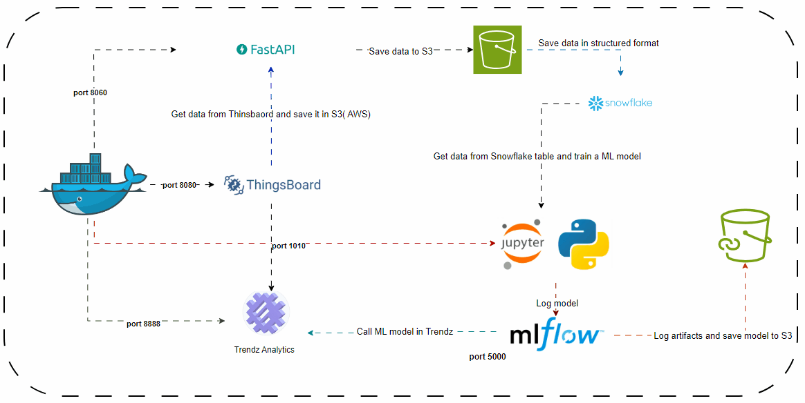

# ThingsBoard Integration and Machine Learning Pipeline

One of the main challenges in integrating AI in institutes is data quality. This project addresses this problem by integrating IoT systems with machine learning. It builds an end-to-end machine learning (MLOps) system integrated with IoT (Thingsboard and Trendz Analytics). The system runs in Docker and can be deployed in a cloud environment. 

## Project Overview

The purpose of this project is to:

1. Collect data from Thingsboard using FastAPI and save it in S3 in unstructured format.
2. In Jupyter Lab, save the data from S3 to Snowflake in table format.
3. Train a machine learning model in Jupyter Lab and log it in MLflow, which saves the model in S3. Monitor the ML performance and other information in MLflow.
4. Call the trained model in Trendz Analytics from MLflow and provide data to get predictions from the custom machine learning model.
5. Optionally, train models directly in Trendz Analytics.

## Services Running in Docker

- **mytb**: Thingsboard, an open-source IoT tool for monitoring and collecting sensor data. Refer to the [official documentation](https://thingsboard.io/docs/user-guide/install/docker/) for deployment instructions.

- **mytrendz**: Trendz Analytics, integrated with Thingsboard for data analysis, graph building, and writing code in JavaScript and Python. Running on port 8888. Follow the [official documentation](https://thingsboard.io/docs/trendz/install/docker/) for setup instructions.

- **mypyexecutor**: Python instance for Trendz Analytics, running on port 8181. Updated to Python 3.11 using a custom Dockerfile in the `trendz` folder.

- **postgres**: Database for saving data from Thingsboard, running on port 5432.

- **fastapi-app**: Docker instance running FastAPI (port 8060) and Jupyter Lab (port 1010).

- **mysql**: Endpoint for MLflow, running on port 3306.

- **minio**: Alternative to S3 for logging models if an AWS account is not available. Running on ports 9001 and 9000.

- **mlflow**: Used for saving models and collecting ML model information. Served on port 5000.

## Getting Started

1. Clone the repository: `git clone https://github.com/HuseynA28/Thingsboard-Mlops.git`
2. Configure the necessary environment variables in the `.env` file.
3. Build and run the Docker containers: `docker-compose up -d`
4. Access the services using the specified ports.

For detailed setup instructions and code, refer to the [GitHub repository](https://github.com/HuseynA28/Thingsboard-Mlops).

## Contributing

Contributions are welcome! If you find any issues or have suggestions for improvements, please open an issue or submit a pull request.

## License

This project is licensed under the [MIT License](LICENSE).